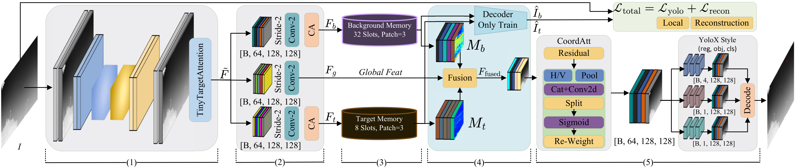

# AMR: Asymmetric Memory-decoupled Reconstruction for Infrared Small Target Detection

<div align="center">

[](https://www.python.org/)
[](https://pytorch.org/)
[](LICENSE)
[]()

**Single-frame infrared small target detection via asymmetric memory-decoupled reconstruction.**

</div>

---

## Abstract

Infrared small target detection remains challenging because tiny target responses are entangled with complex background clutter in shared feature representations. AMR introduces an **asymmetric memory-decoupled reconstruction framework** that structurally separates target and background representations through:

1. **Dedicated memory branches with asymmetric capacities** (8 target slots vs. 32 background slots)
2. **A decoupled mutual-exclusive fusion gate** that enhances targets while suppressing clutter
3. **A residual reconstruction loss** encoding four physically motivated constraints

With merely **1.94M parameters**, AMR achieves **92.73 mAP on ITSDT-15K** and **97.53 mAP on IRDST**, surpassing the best single-frame baseline by 22.3 and 31.0 mAP respectively, and outperforming all multi-frame competitors in mAP on both benchmarks.

---

## Table of Contents

- [Quick Start (5 minutes)](#quick-start)
- [Environment Setup](#environment-setup)
  - [Option A: uv (recommended)](#option-a-uv-recommended)
  - [Option B: conda](#option-b-conda)
  - [Option C: pip + venv](#option-c-pip--venv)
- [Dataset Preparation](#dataset-preparation)
- [Pretrained Weights](#pretrained-weights)
- [Inference](#inference)
  - [Single Image Demo](#single-image-demo)
  - [Batch Evaluation](#batch-evaluation)
- [Training](#training)
  - [Single GPU](#single-gpu)
  - [Multi-GPU Distributed](#multi-gpu-distributed)
  - [Resume Training](#resume-training)
- [Results](#results)
- [Model Architecture](#model-architecture)
- [Project Structure](#project-structure)
- [AI for Reproduction](#ai-for-reproduction)
- [Citation](#citation)
- [License](#license)

---

## Quick Start

```bash
# 1. Clone and enter
git clone https://github.com/YourUsername/AMR-ISTD.git
cd AMR-ISTD

# 2. Setup environment (choose one)
uv sync                                    # uv (recommended)
# conda env create -f environment.yml      # conda
# pip install -r requirements.txt          # pip

# 3. Run inference on a single image
python demo.py \
  --weights weights/amr_irdst_best.pth \
  --config configs/irdst.yaml \
  --image path/to/your/image.png \
  --output result.png

# 5. Evaluate on full test set
python eval.py \
  --weights weights/amr_irdst_best.pth \
  --config configs/irdst.yaml
```

---

## Environment Setup

### Option A: uv (recommended)

[`uv`](https://docs.astral.sh/uv/) is a fast Python package manager. Install it first:

```bash
# Install uv (Linux/macOS)
curl -LsSf https://astral.sh/uv/install.sh | sh

# Or on Windows
powershell -c "irm https://astral.sh/uv/install.ps1 | iex"
```

Then create the environment:

```bash
cd AMR-ISTD

# Create virtual environment and install all dependencies
uv sync

# Activate the environment
source .venv/bin/activate   # Linux/macOS
# .venv\Scripts\activate    # Windows
```

**Customizing CUDA version:** Edit `pyproject.toml` and change the PyTorch index URL:

```toml
# For CUDA 11.8
[[tool.uv.index]]
name = "pytorch-cu118"
url = "https://download.pytorch.org/whl/cu118"

# For CPU-only
# Remove the PyTorch index and install CPU torch manually
```

### Option B: conda

```bash
cd AMR-ISTD

# Create conda environment
conda env create -f environment.yml

# Activate
conda activate amr-istd
```

**Note:** `pycocotools` is installed via pip inside the conda environment. If you encounter issues, install it manually:

```bash
pip install pycocotools
```

### Option C: pip + venv

```bash
cd AMR-ISTD

# Create virtual environment
python -m venv .venv
source .venv/bin/activate

# Install PyTorch first (adjust CUDA version as needed)
pip install torch torchvision --index-url https://download.pytorch.org/whl/cu121

# Install remaining dependencies
pip install -r requirements.txt
```

### Verify Installation

```bash
python -c "import torch; print(f'PyTorch {torch.__version__}'); print(f'CUDA available: {torch.cuda.is_available()}')"
```

Expected output:
```
PyTorch 2.1.x
CUDA available: True
```

---

## Dataset Preparation

AMR is trained and evaluated on two public datasets:

| Dataset | Description | Download Link |
|---------|-------------|---------------|
| **IRDST** | Infrared Small Target Detection dataset | [xzbai.buaa.edu.cn](https://xzbai.buaa.edu.cn/datasets.html) |
| **ITSDT-15K** | Infrared Target Segmentation and Detection dataset (15K) | [scidb.cn](https://www.scidb.cn/en/detail?dataSetId=de971a1898774dc5921b68793817916e&dataSetType=journal) |

### Dataset Directory Structure

Download and organize each dataset following this structure:

```
dataset/
└── IRDST/
    └── IRDST_real/
        ├── images/
        │   ├── train/          # Training images (.png)
        │   └── test/           # Test images (.png)
        ├── masks/
        │   ├── train/          # Binary segmentation masks (.png)
        │   └── test/
        ├── boxes/
        │   ├── train/          # Bounding box annotations (.txt, one per image)
        │   └── test/
        └── center/
            ├── train/          # Target center coordinates
            └── test/
```

### Box Annotation Format

Each `.txt` file contains one bounding box per line:

```
x1 y1 x2 y2 class_id
```

Example (`image_001.txt`):
```
234 189 241 196 0
310 245 317 252 0
```

### Dataset Configuration

Update `dataset_root` in the config file:

```yaml
# configs/irdst.yaml
data:
  dataset_type: irdst           # "irdst" | "itsdt"
  dataset_root: ./dataset/IRDST/IRDST_real/  # Your dataset path
```

### Input Processing

- **Input:** Single-channel grayscale infrared images are converted to 3-channel RGB (grayscale replicated to R/G/B)
- **Normalization:** ImageNet standard (`mean=[0.485, 0.456, 0.406]`, `std=[0.229, 0.224, 0.225]`)
- **Size:** All images are resized to 512×512

---

## Pretrained Weights

Pretrained weights are included in the repository under `weights/`:

| Dataset | File | mAP@0.5 | Size |
|---------|------|---------|------|
| IRDST | `weights/amr_irdst_best.pth` | 97.53 | 7.5 MB |
| ITSDT-15K | `weights/amr_itsdt_best.pth` | 92.73 | 7.5 MB |

No additional download is needed — weights are ready to use after cloning the repository.

---

## Inference

### Single Image Demo

```bash
python demo.py \
  --weights weights/amr_irdst_best.pth \
  --config configs/irdst.yaml \
  --image path/to/your/image.png \
  --output result.png \
  --conf-thresh 0.5
```

**Arguments:**

| Argument | Default | Description |
|----------|---------|-------------|
| `--weights` | (required) | Path to checkpoint (.pth) |
| `--config` | `configs/irdst.yaml` | Model configuration |
| `--image` | — | Single input image path |
| `--image-dir` | — | Batch: directory of images |
| `--output` | — | Output path (single image mode) |
| `--output-dir` | `outputs/` | Output directory (batch mode) |
| `--conf-thresh` | `0.5` | Confidence threshold |
| `--nms-thresh` | `0.2` | NMS IoU threshold |
| `--device` | `cuda:0` | Device: cuda:0, cpu |

### Batch Evaluation

Evaluate on the full test set:

```bash
# IRDST
python eval.py \
  --weights weights/amr_irdst_best.pth \
  --config configs/irdst.yaml

# ITSDT-15K
python eval.py \
  --weights weights/amr_itsdt_best.pth \
  --config configs/itsdt.yaml

# Custom thresholds
python eval.py \
  --weights weights/amr_irdst_best.pth \
  --config configs/irdst.yaml \
  --conf-thresh 0.001 \
  --device cuda:0
```

---

## Training

### Single GPU

```bash
python train.py --config configs/irdst.yaml
```

This runs in non-distributed mode automatically if only one GPU is detected.

### Multi-GPU Distributed

```bash
# 4-GPU training (recommended)
torchrun --nproc_per_node=4 train.py --config configs/irdst.yaml

# 2-GPU training
torchrun --nproc_per_node=2 train.py --config configs/irdst.yaml
```

**Training config reference** (from `configs/irdst.yaml`):

```yaml
training:
  batch_size: 8            # Per-GPU batch size
  accumulation_steps: 1    # No gradient accumulation
  epochs: 100
  fp16: true               # Mixed precision training
  lr: 0.001
  weight_decay: 0.01
```

### Resume Training

```bash
torchrun --nproc_per_node=4 train.py \
  --config configs/irdst.yaml \
  --resume logs/irdst/20260529_140423
```

The `--resume` path should point to the checkpoint directory containing `last.pth`.

### Monitoring

```bash
tensorboard --logdir ./logs --port 6006
```

Open `http://localhost:6006` in your browser.

### Loss Interpretation

During training, the tqdm progress bar shows:

```
Epoch 1/100: 100%|████| total=0.424 yolo=0.347 box=0.235 obj=0.112 res_recon=0.077
```

| Loss | Meaning |
|------|---------|
| `total` | Overall loss (should decrease) |
| `yolo` | YOLOX detection loss |
| `box` | Bounding box regression |
| `obj` | Objectness confidence |
| `res_recon` | Residual reconstruction loss (decomposition quality) |

---

## Results

### Main Results

AMR is compared with representative ISTD methods on IRDST and ITSDT-15K.
Bold indicates the best result; underline indicates the second-best. $\bigstar$ denotes multi-frame methods.

| Method | Venue | ITSDT mAP$_{50}$ | ITSDT F1 | IRDST mAP$_{50}$ | IRDST F1 |
|--------|-------|:-----------:|:---------:|:-----------:|:---------:|
| **AMR (Ours)** | — | **92.73** | **93.14** | **97.53** | **97.44** |
| *Single-frame* | | | | | |
| DNANet | TIP 2023 | 70.46 | 84.46 | 63.61 | 80.11 |
| UIUNet | TIP 2022 | 65.15 | 81.13 | 56.38 | 75.25 |
| MSHNet | CVPR 2024 | 60.82 | 77.64 | 63.21 | 79.91 |
| AGPCNet | TAES 2023 | 67.27 | 82.16 | 59.21 | 77.44 |
| *Multi-frame* $\bigstar$ | | | | | |
| TMP | ESWA 2024 | 77.73 | 88.67 | 70.03 | 83.97 |
| MoPKL | AAAI 2025 | 79.78 | 89.92 | 74.54 | 86.84 |
| MOCID | AAAI 2025 | 86.84 | 91.40 | 94.74 | 97.88 |
| TDCNet | AAAI 2026 | 88.17 | 95.61 | 94.79 | 97.91 |

AMR achieves the **highest mAP** among all methods on both benchmarks, using only a single frame.
It surpasses the best single-frame competitor by 22.3 mAP on ITSDT-15K and 31.0 mAP on IRDST,
and outperforms all multi-frame methods in mAP.

### Efficiency (on ITSDT-15K)

| Metric | Value |
|--------|-------|
| Parameters | 1.94 M |
| FLOPs | 36.76 G |
| FPS | 43.84 |
| Input size | 512$\times$512 |

---

## Model Architecture



```
Input Image [B, 3, H, W]   (grayscale to RGB + ImageNet norm)
    |
[UNetBackbone]             depth=3, base_channels=16 → [B, 64, H, W]
    |  + TinyTargetAttention
[FeatureSplitBranch]       2× stride-2 conv → [B, 128, H/4, W/4]
    ├── global_feat
    ├── target_feat        + ChannelAttention
    └── background_feat    + ChannelAttention
    |
[Asymmetric Memory Reconstruction]
    ├── TargetBranch       8 memory slots, Top-2, 3×3 patches
    └── BackgroundBranch   32 memory slots, Top-4, 3×3 patches
    |
[ArithmeticFusion]         spatial_reweight with mutual-exclusive gate
    |
[CoordAtt Neck]            Coordinate Attention 
    |
[Detection Head]           YOLOX-style, stride=4
    ├── P0_reg  [B, 4, H/4, W/4]
    ├── P0_obj  [B, 1, H/4, W/4]
    └── P0_cls  [B, 1, H/4, W/4]
```

### Key Design Choices

1. **Asymmetric Memory Capacity:** 8 target slots vs. 32 background slots. PSF-constrained targets need far fewer prototypes than diverse background textures.

2. **Mutual-Exclusive Fusion Gate:** `fused = F_global × (1 + w_target) × (1 - w_background × (1 - w_target))`. The target-aware gating prevents the background suppression from accidentally weakening target signals.

3. **Residual Reconstruction Loss:** Four physically motivated constraints:
   - **Global decomposition:** `L1(rec_bg + rec_tgt, image)`
   - **Target sparsity:** `L2((1-mask) × rec_tgt)` — target signal should only exist inside target regions
   - **Target content:** `MSE(mask × rec_tgt, mask × image)` — preserve target details
   - **Background inpainting:** Inpainting loss in target regions — background should look natural even where targets were removed

---

## Project Structure

```
AMR-ISTD/
├── README.md                  # This file
├── LICENSE                    # MIT License
├── .gitignore
├── requirements.txt           # pip dependencies
├── pyproject.toml             # uv project config
├── environment.yml            # conda environment
│
├── model/                     # Model architecture
│   ├── __init__.py            # Package exports
│   ├── network.py             # AMR network + all submodules
│   ├── losses.py              # ResidualReconstructionLoss, FocalLoss, NWDLoss
│   └── yolox_loss_optimized.py  # YOLOX loss with SimOTA
│
├── utils/                     # Utility functions
│   ├── __init__.py
│   ├── eval_utils.py          # evaluate_detection(), print_evaluation_report()
│   └── utils_bbox.py          # Bounding box decode, NMS
│
├── configs/                   # Training configurations
│   ├── irdst.yaml             # IRDST dataset config
│   └── itsdt.yaml             # ITSDT-15K dataset config
│
├── dataloader.py              # Dataset classes (IRDST, ITSDT)
├── train.py                   # Training script (single + distributed)
├── eval.py                    # Evaluation script
├── demo.py                    # Single image inference demo
│
├── assets/
│   └── architecture.pdf        # Model architecture diagram
│
└── weights/                    # Pretrained weights
    ├── amr_irdst_best.pth       # IRDST (97.53 mAP)
    └── amr_itsdt_best.pth       # ITSDT-15K (92.73 mAP)
```

---

## AI for Reproduction

You can use an AI coding assistant (Claude Code, Codex CLI, etc.) to set up the entire environment and run inference in one shot. Copy the following prompt into your AI assistant:

````markdown
## Task: Reproduce AMR Infrared Small Target Detection

Please help me set up and run the AMR model on my local machine. Here is what I need:

### 1. Environment Setup
My system: [describe your OS, GPU, CUDA version]

- Clone the repository: `git clone https://github.com/YourUsername/AMR-ISTD.git`
- Enter the directory: `cd AMR-ISTD`
- Check my Python version (need >= 3.11)
- Set up the Python environment using one of:
  - If I have `uv` installed: run `uv sync`
  - If I have `conda`: run `conda env create -f environment.yml`
  - Otherwise: create a venv and install from requirements.txt

### 2. Verify Installation
Run `python -c "import torch; print(torch.__version__); print(torch.cuda.is_available())"`
to confirm PyTorch and CUDA are working.

### 3. Prepare Dataset (Optional)
If I want to run evaluation or training, guide me to download the IRDST or
ITSDT-15K dataset and place it in the `dataset/` directory following the
structure in README.md. For inference only, no dataset is needed.

### 4. Run Inference
Pretrained weights are already in the `weights/` directory. Run:
```
python demo.py --weights weights/amr_irdst_best.pth --config configs/irdst.yaml --image <test_image> --output result.png
```

If I don't have a test image, generate a synthetic one or help me find a sample.

### 5. Expected Results
- The model should detect small bright targets in infrared images
- Detection boxes are drawn on the output image
- If running eval.py on the full test set, expect:
  - IRDST: ~97.53 mAP@0.5
  - ITSDT-15K: ~92.73 mAP@0.5

Please proceed step by step and report progress at each stage.
````

### Customizing the AI Prompt

- Replace `YourUsername/AMR-ISTD` with the actual GitHub repository URL
- Adjust CUDA version based on your hardware
- If you have dataset access, provide the dataset path

---

## Citation

If you use AMR in your research, please cite:

```bibtex
@article{amr2025,
  title={AMR: Asymmetric Memory-decoupled Reconstruction for Infrared Small Target Detection},
  author={Anonymous Authors},
  journal={Under review},
  year={2025}
}
```

---

## License

This project is released under the [MIT License](LICENSE).

---

## Acknowledgments

This work builds upon the infrared small target detection community's efforts. We thank the authors of [IRDST](https://xzbai.buaa.edu.cn/datasets.html) and [ITSDT-15K](https://www.scidb.cn/en/detail?dataSetId=de971a1898774dc5921b68793817916e&dataSetType=journal) datasets for making their data publicly available.
